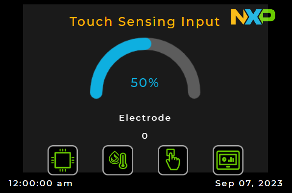
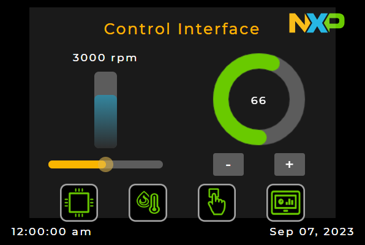

# NXP Application Code Hub

## Industrial Panel FRDM-MCXN947

This demo demostrate capabilities of new FRDM-MCXN947. With only one core, demo runs motor control, lvgl, server, two temperature sensors, touch sensitive and get core performance. Include two graphic interfaces, lcd screen and http server, both support interacion and contains same values. Graphic interface in lcd has four screens, that screens allows to watch core performance, microcontroler temperature, board temperature, touch sensitive, manual counter and set rpm in motor. In http server has one page that shows all screens where can do and watch the same as the lcd.

     
    

#### Boards: FRDM-MCXN947
#### Categories: Graphics, Industrial, Motor Control, Sensor
#### Peripherals: ADC, PWM, UART, TIMER, I2C, ETHERNET
#### Toolchains: MCUXpresso IDE, VS Code

## Table of Contents
1. [Software](#step1)
2. [Hardware](#step2)
3. [Setup](#step3)
4. [Results](#step4)
5. [FAQs](#step5) 
6. [Support](#step6)
7. [Release Notes](#step7)

## 1. Software
- [MCUXpresso 11.9.0 or newer.](https://nxp.com/mcuxpresso)
- [MCUXpresso for VScode 1.5.61 or newer](https://www.nxp.com/products/processors-and-microcontrollers/arm-microcontrollers/general-purpose-mcus/lpc800-arm-cortex-m0-plus-/mcuxpresso-for-visual-studio-code:MCUXPRESSO-VSC?cid=wechat_iot_303216)
- [SDK for FRDM-MCXN947.](https://mcuxpresso.nxp.com/en/select)

## 2. Hardware
- [FRDM-MCXN947.](https://www.nxp.com/products/processors-and-microcontrollers/arm-microcontrollers/general-purpose-mcus/mcx-arm-cortex-m/mcx-n94x-and-n54x-mcus-with-dual-core-arm-cortex-m33-eiq-neutron-npu-and-edgelock-secure-enclave-core-profile:MCX-N94X-N54X)   

- [LCD-PAR-S035.](https://www.nxp.com/design/design-center/development-boards/3-5-480x320-ips-tft-lcd-module:LCD-PAR-S035)    

- [FRDM-MC-LVPMSM.](https://www.nxp.com/design/design-center/development-boards/freedom-development-boards/mcu-boards/nxp-freedom-development-platform-for-low-voltage-3-phase-pmsm-motor-control:FRDM-MC-LVPMSM)
- [FRDM-MC-LVMTR.](https://www.nxp.com/design/design-center/development-boards/freedom-development-boards/mcu-boards/low-voltage-3-phase-motor-for-frdm-platform:FRDM-MC-LVMTR)   

- Power supply 24 volts 5 amperes
- USB Type-C cable.
- Personal computer.

## 3. Setup

### 3.1 Step 1
1. Open MCUXpresso IDE, in the Quick Start Panel, choose Import from Application Code Hub   

2. Enter the demo name in the search bar.    

3. Click Copy GitHub link, MCUXpresso IDE will automatically retrieve project attributes, then click Next>.    

4. Select main branch and then click Next>, Select the MCUXpresso project, click Finish button to complete import.    

### 3.2 Connect hardware
1. Prepare motor control shield board. There is one signal shared between the LCD header and the Arduino header, is the third pin of J1. You need to fold it in order to avoid seeing interference in the display.   

2. Connect the Motor cables to the motor control shield as the picture below. Motor sensors are not required for this demo.    

3. Plugin the LCD-PAR-S025 board on J8. LCD-PAR-S025 has two extra rows that will not match with the J8 of the FRDM-MCXN947 board so make you it is connected properly as the picture below.   

4. Assembly the motor control shield on top of the FRDM-MCXN947.
5. Plugin Ethernet (J16)  and USB type-C (J17) cables to the FRDM-MCXN947 board and connect the other sides to the host computer.
6. Connect 24v power supply to the motor control shield and press the reset button on the FRM-MCXN947 board. 
### 3.3 Configure network settings on your computer
1. You will need to change the ethernet network settings on your computer. On Windows machines open Windows settings -> Network & Internet -> Ethernet.   

2. Select the Ethernet device you have connected to the FRDM-MCXN947 board and edit the IP settings.
3. Save configuration.
### 3.4 Run Demo
1. Build project.
2. Connect FRDM-MCXN947 to computer with USB Type-C
3. Upload code to FRDM-MCXN947
4. If you have open your internet browser, close it.
5. Push reset button on the FRDM-MCXN947 board and now motor will be run.
5. Wait five seconds.
6. Open you browser and put next link 192.168.0.102/index.html

## 4. Results
- Change between screens, test sensors, modify motor rpm and try interaction of web page and screens.

## 5. FAQs
No FAQs have been identified for this project.

## 6. Support

#### Project Metadata
<!----- Boards ----->

<!----- Categories ----->
   

<!----- Peripherals ----->
     

<!----- Toolchains ----->
 

Questions regarding the content/correctness of this example can be entered as Issues within this GitHub repository.

>**Warning**: For more general technical questions regarding NXP Microcontrollers and the difference in expected funcionality, enter your questions on the [NXP Community Forum](https://community.nxp.com/)

## 7. Release Notes
| Version | Description / Update                           | Date                        |
|:-------:|------------------------------------------------|----------------------------:|
| 1.0     | Initial release on Application Code Hub        | January 30th 2024 |

