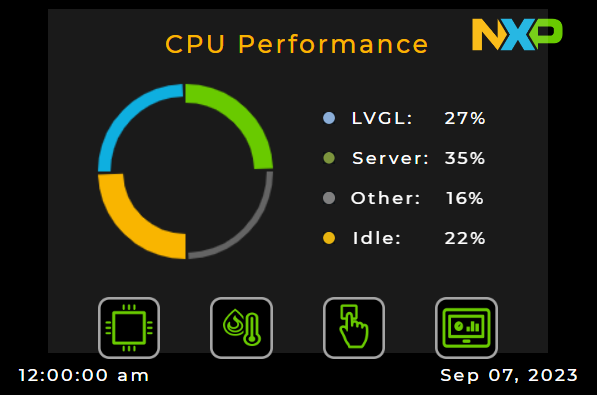
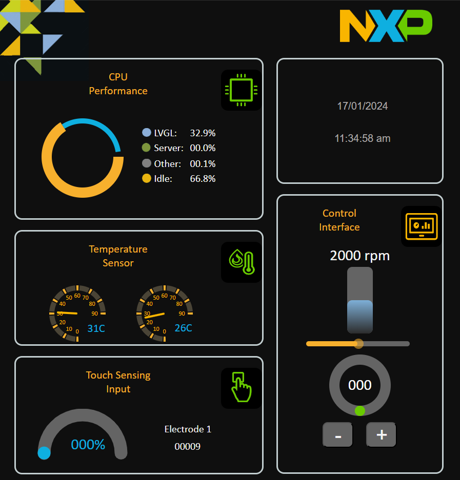

# NXP Application Code Hub

## Industrial Panel WiFi FRDM-MCXN947

This demo demostrate capabilities of new FRDM-MCXN947.  
There has some variants that are divided on branches in [Application Code Hub](https://github.com/nxp-appcodehub)     
### Branches
1. [main:](https://github.com/nxp-appcodehub/dm-industrial-panel-frdm-mcxn947.git)
    Here Industrial panel runs with server using ethernet.
2. [wifi:](https://github.com/nxp-appcodehub/dm-industrial-panel-frdm-mcxn947/tree/wifi)
    In the other hand, There is Industrial panel with wifi. This use 88mw320 with web server, that has comunication with FRDM-MCXN947 that runs Industrial panel.
### Demo   
With only one core, demo runs motor control, lvgl, server interface, temperature sensor, touch sensitive and get core performance. Include two graphic interfaces, lcd screen and http server, both support interacion and contains same values. Graphic interface in lcd has four screens, that screens allows to watch core performance, microcontroler temperature, touch sensitive, manual counter and set rpm in motor. In http server has one page that shows all screens where can do and watch the same as the lcd. Server runs in 88MW320.

     
    

#### Boards: FRDM-MCXN947, 88MW320
#### Categories: Graphics, Industrial, Motor Control, Sensor
#### Peripherals: ADC, PWM, UART, TIMER, I2C
#### Toolchains: MCUXpresso IDE, VS Code

## Table of Contents
1. [Software](#step1)
2. [Hardware](#step2)
3. [Setup](#step3)
4. [Results](#step4)
5. [FAQs](#step5) 
6. [Support](#step6)
7. [Release Notes](#step7)

## 1. Software
- [MCUXpresso 11.9.0 or newer.](https://nxp.com/mcuxpresso)
- [MCUXpresso for VScode 1.5.61 or newer](https://www.nxp.com/products/processors-and-microcontrollers/arm-microcontrollers/general-purpose-mcus/lpc800-arm-cortex-m0-plus-/mcuxpresso-for-visual-studio-code:MCUXPRESSO-VSC?cid=wechat_iot_303216)
- [SDK for FRDM-MCXN947.](https://mcuxpresso.nxp.com/en/select)
- [JLink Commander](https://www.segger.com/products/debug-probes/j-link/tools/j-link-commander/)

## 2. Hardware
- [FRDM-MCXN947.](https://www.nxp.com/products/processors-and-microcontrollers/arm-microcontrollers/general-purpose-mcus/mcx-arm-cortex-m/mcx-n94x-and-n54x-mcus-with-dual-core-arm-cortex-m33-eiq-neutron-npu-and-edgelock-secure-enclave-core-profile:MCX-N94X-N54X)   

- [LCD-PAR-S035.](https://www.nxp.com/design/design-center/development-boards/3-5-480x320-ips-tft-lcd-module:LCD-PAR-S035)    

- [FRDM-MC-LVPMSM.](https://www.nxp.com/design/design-center/development-boards/freedom-development-boards/mcu-boards/nxp-freedom-development-platform-for-low-voltage-3-phase-pmsm-motor-control:FRDM-MC-LVPMSM)
- [FRDM-MC-LVMTR.](https://www.nxp.com/design/design-center/development-boards/freedom-development-boards/mcu-boards/low-voltage-3-phase-motor-for-frdm-platform:FRDM-MC-LVMTR)   

- [88MW320](https://www.digikey.com.mx/es/products/detail/murata-electronics/CMWC1ZZABR-107-EVB/16033784)   

- [Segger-JLink](https://www.segger.com/products/debug-probes/j-link/models/j-link-plus/)
- Power supply 24 volts 5 amperes
- USB Type-C cable.
- Personal computer.

## 3. Setup

### 3.1 Step 1
1. Open MCUXpresso IDE, in the Quick Start Panel, choose Import from Application Code Hub   

2. Enter the demo name in the search bar.    

3. Click Copy GitHub link, MCUXpresso IDE will automatically retrieve project attributes, then click Next>.    

4. Select main branch and then click Next>, Select the MCUXpresso project, click Finish button to complete import.    

### 3.2 Connect hardware
1. Prepare motor control shield board. There is one signal shared between the LCD header and the Arduino header, is the third pin of J1. You need to fold it in order to avoid seeing interference in the display.   

2. Connect the Motor cables to the motor control shield as the picture below. Motor sensors are not required for this demo.    

3. Plugin the LCD-PAR-S035 board on J8. LCD-PAR-S035 has two extra rows that will not match with the J8 of the FRDM-MCXN947 board so make you it is connected properly as the picture below.   

4. Assembly the motor control shield on top of the FRDM-MCXN947.
5. Fold Reset pin of 88MW320 and assembly on mikroe connector of FRDM-MCXN947 
### 3.3 Upload code to 88MW320
1. Connect Segger JLink
2. Connect FRDM-MCXN947 to computer
3. Open JLink Commander
4. Write following commands
    #### a. connect
    #### b. 88MW320
    #### c. S
    #### d. 4000
    #### e. exec EnableEraseAllFlashBanks
    #### f. erase
    #### g. loadbin (ProjectPath)\88mw320_binary\industrial_panel_mw_320.bin 0x1F000000
5. Disconnect Segger JLink and FRDM-MCXN947
### 3.4 Run Demo
1. Build project.
2. Connect FRDM-MCXN947 to computer with USB Type-C
3. Connect 24v power supply to the motor control shield and press the reset button on the FRM-MCXN947 board. 
4. Upload code to FRDM-MCXN947
5. Push reset button on the FRDM-MCXN947 board and now motor will be run.
6. Wait five seconds.
7. Connect to network nxp_industrial_panel with the password NXP012345
8. Open you browser and put next link 192.168.1.1/index.html

## 4. Results
- Change between screens, test sensors, modify motor rpm and try interaction of web page and screens.

## 5. FAQs
No FAQs have been identified for this project.

## 6. Support

#### Project Metadata
<!----- Boards ----->

<!----- Categories ----->
     

<!----- Peripherals ----->
         

<!----- Toolchains ----->
 

Questions regarding the content/correctness of this example can be entered as Issues within this GitHub repository.

>**Warning**: For more general technical questions regarding NXP Microcontrollers and the difference in expected funcionality, enter your questions on the [NXP Community Forum](https://community.nxp.com/)

## 7. Release Notes
| Version | Description / Update                           | Date                        |
|:-------:|------------------------------------------------|----------------------------:|
| 1.0     | Initial release on Application Code Hub        | March 22nd 2024 |
